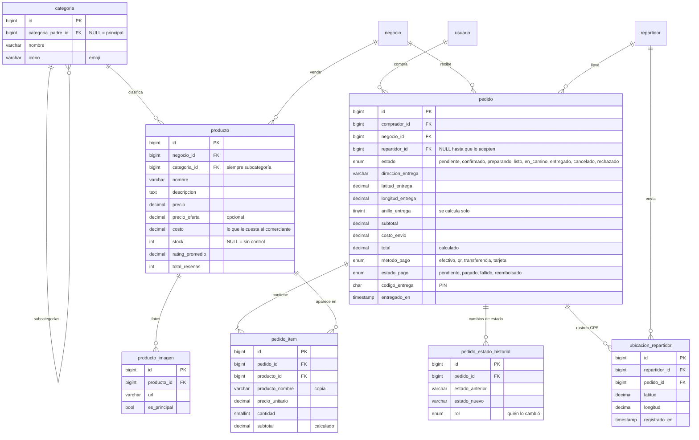
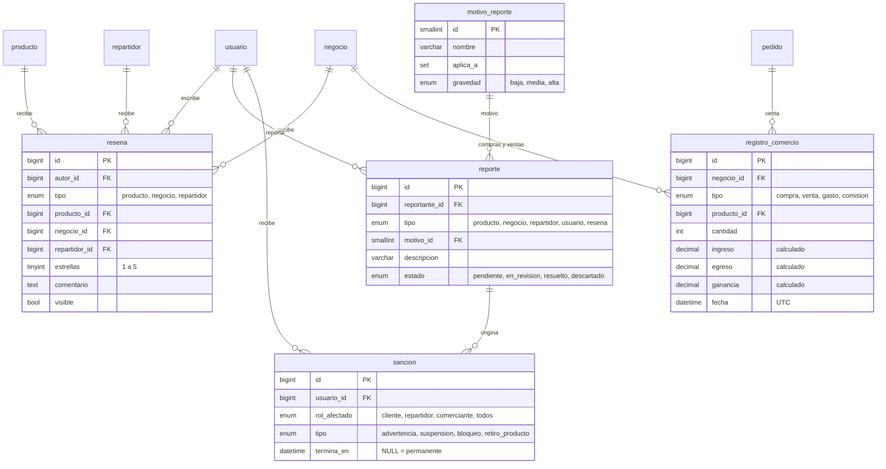

# Diagrama de la base de datos

Esquema visual de las tablas principales de `mdrmarket_new` y cómo se
relacionan. GitHub dibuja estos diagramas automáticamente.

- Solo se muestran los **campos más importantes** de cada tabla.
- La definición completa (todas las columnas, tipos y comentarios) está en el
  script [`mdrmarketnewdatabase.sql`](https://github.com/RaschifDaguer/MDRmarket_2.0_docker/blob/main/mdrmarketnewdatabase.sql).
- Explicación de cada tabla, vista y trigger: [BASE_DE_DATOS.md](BASE_DE_DATOS.md).
- Qué datos recibe la app en cada pantalla: [API_FRONTEND.md](API_FRONTEND.md).

**Cómo leer las líneas:** `||--o{` = "uno a muchos" (un usuario tiene muchas
direcciones); `||--o|` = "uno a uno opcional" (un usuario puede tener un
perfil de repartidor).

---

## 1. Usuarios y roles

Una sola cuenta por persona. Repartidor y comerciante son perfiles que
"cuelgan" del usuario.

```mermaid
erDiagram
    usuario ||--o{ direccion : "guarda"
    usuario ||--o| repartidor : "puede ser"
    usuario ||--o{ negocio : "es dueño de"
    usuario ||--o{ documento : "sube"
    repartidor ||--o{ vehiculo : "registra"
    tipo_vehiculo ||--o{ vehiculo : "clasifica"
    categoria_vehiculo ||--o{ tipo_vehiculo : "agrupa"
    tipo_documento ||--o{ documento : "tipo de"
    vehiculo ||--o{ documento : "foto, placa, RUAT"
    negocio ||--o{ documento : "NIT"

    usuario {
        bigint id PK
        varchar nombre
        varchar apellido
        varchar email UK
        varchar password "cifrada"
        varchar ci_numero "carnet"
        varchar ci_complemento
        enum ci_expedido "SC, LP, CB..."
        enum rol_activo "cliente, repartidor, comerciante, admin"
        bool es_admin
        timestamp deleted_at "borrado lógico"
    }
    direccion {
        bigint id PK
        bigint usuario_id FK
        varchar etiqueta "Casa, Trabajo"
        varchar direccion
        decimal latitud
        decimal longitud
    }
    repartidor {
        bigint usuario_id PK, FK
        enum estado_verificacion "pendiente, aprobado, rechazado, suspendido"
        bool disponible "en línea"
        decimal latitud_actual
        decimal longitud_actual
        decimal rating_promedio
        int total_entregas
    }
    vehiculo {
        bigint id PK
        bigint repartidor_id FK
        tinyint tipo_vehiculo_id FK
        varchar placa
        varchar ruat
        bool en_uso
    }
    tipo_vehiculo {
        tinyint id PK
        tinyint categoria_vehiculo_id FK
        varchar codigo "moto, bicicleta, auto, camioneta, camion"
        bool requiere_placa
        bool requiere_ruat
        bool requiere_licencia
    }
    categoria_vehiculo {
        tinyint id PK
        varchar codigo "liviano, mediano, grande"
    }
    negocio {
        bigint id PK
        bigint usuario_id FK "dueño"
        bigint categoria_id FK "rubro"
        varchar nombre
        varchar nit "opcional"
        decimal latitud "GPS"
        decimal longitud
        varchar logo_url "foto del negocio"
        bool abierto
        enum estado_verificacion
        decimal rating_promedio
    }
    documento {
        bigint id PK
        bigint usuario_id FK
        smallint tipo_documento_id FK
        bigint vehiculo_id FK "si es del vehículo"
        bigint negocio_id FK "si es del negocio"
        varchar archivo_url
        enum estado "pendiente, aprobado, rechazado"
    }
    tipo_documento {
        smallint id PK
        varchar codigo "ci_anverso, ci_reverso, licencia_conducir, foto_vehiculo, foto_placa, ruat, nit"
        enum ambito "persona, vehiculo, negocio"
    }
```

---

## 2. Catálogo, pedidos y rastreo

Tablas de envío sin relaciones directas: `tarifa_envio` (precio por km según
`categoria_vehiculo`) y `anillo` (radios del 1er al 10mo anillo).

---

## 3. Reseñas, reportes, sanciones y ganancias

